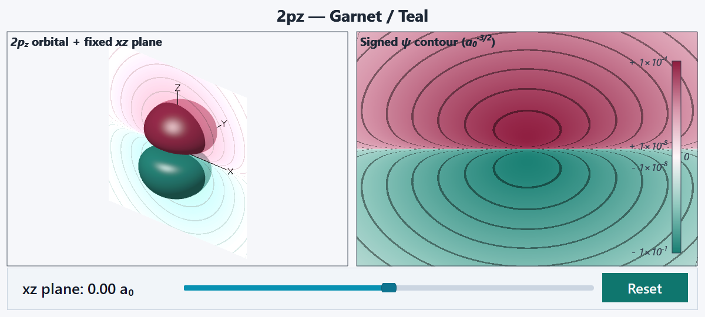
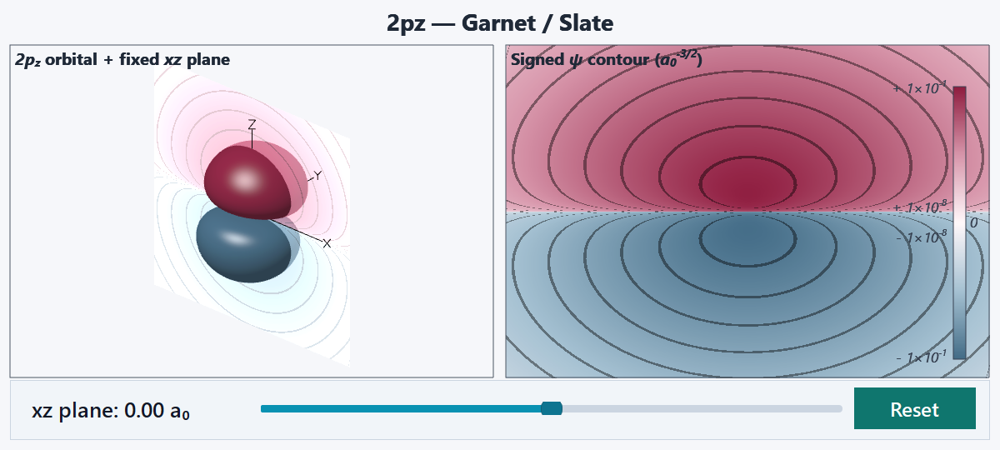

# Orbital colors for the CHC garnet theme

Two divergent palettes designed for the chemical-bonding decks. Both use the
active theme's garnet (`#8E1B3E`) for positive wavefunction values and its pale
rose block color (`#FFF8FA`) around zero. Surface phase colors match the
corresponding contour endpoints.

| Scheme | Negative phase | Neutral | Positive phase | Use |
| --- | --- | --- | --- | --- |
| `garnet_teal` | `#177E72` | `#FFF8FA` | `#8E1B3E` | Closest match: uses the deck's existing garnet and teal orbital surfaces. |
| `garnet_slate` | `#426B86` | `#FFF8FA` | `#8E1B3E` | Quieter alternative: muted blue complements the burgundy headers. |

The examples show the same 2pz orbital, sampling plane, and absolute color scale
so the palette is the only difference. The two lobes show both phase colors together, while the contour view exposes
the angular node.

## Garnet–Teal



Copy these fields into an existing `.uilorb` definition, preserving its other
surface and contour settings:

```json
"surface": {
  "positive_color": "#8E1B3E",
  "negative_color": "#177E72"
},
"contour": {
  "colormap": "garnet_teal"
}
```

A complete ready-to-embed definition is in [garnet_teal.uilorb](garnet_teal.uilorb).

## Garnet–Slate



Use `"negative_color": "#426B86"` and `"colormap": "garnet_slate"`, keeping
`"positive_color": "#8E1B3E"`. A complete definition is in
[garnet_slate.uilorb](garnet_slate.uilorb).

Append `_r` to either colormap name to reverse its contour colors; swap
`positive_color` and `negative_color` as well to keep surface and contour
phases consistent. Palette selection does not change orbital values or scales.

Regenerate these previews from the repository root after renderer changes:

```sh
build-windows/atomic_orbital_preview_generator.exe \
  examples/atomic-orbital/color-schemes \
  examples/atomic-orbital/color-schemes/garnet_teal.uilorb \
  examples/atomic-orbital/color-schemes/garnet_slate.uilorb
```
